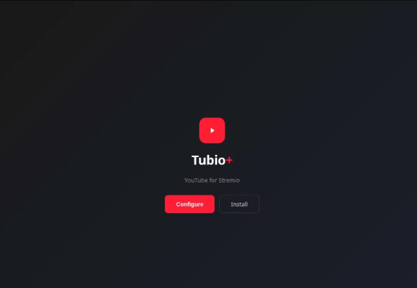
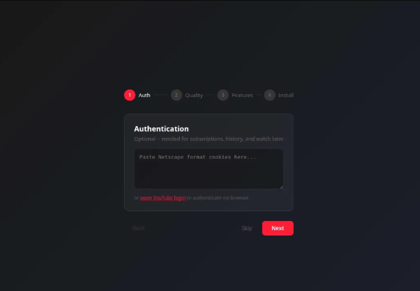
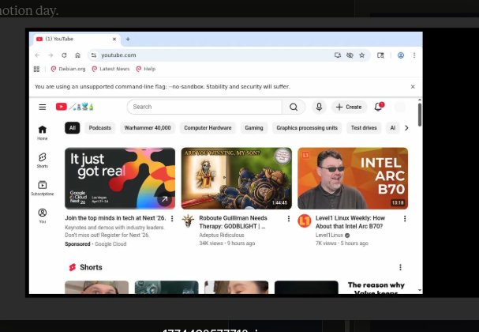
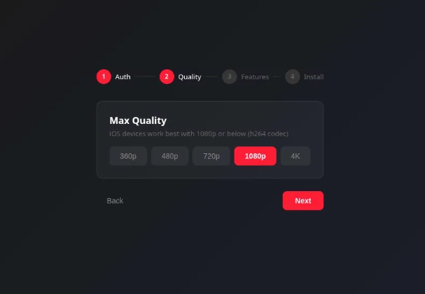
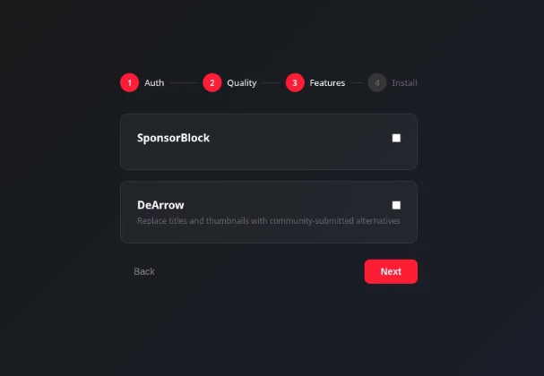
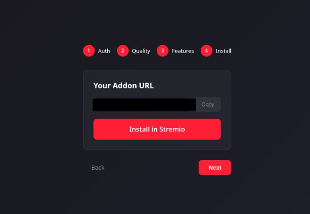

# TubioPlus

A **Stremio addon** that lets you search, browse, and stream YouTube content directly inside Stremio — with quality up to 4K, subtitles, SponsorBlock, and browser-based login.

Forked from [YouTubio](https://github.com/xXCrash2BomberXx/YouTubio). Vibe coded with love.

---

## ✨ Features

- **Stream YouTube in Stremio** — Search, recommendations, subscriptions, history, and watch later, all inside Stremio.
- **Up to 4K Playback** — Quality selection from 360p to 2160p with on-the-fly FFmpeg muxing.
- **Subtitles** — Multi-language subtitles and YouTube auto-captions, selectable during playback.
- **SponsorBlock** — See how many sponsor segments, intros, and outros are in a video before you watch.
- **DeArrow** — Replace clickbait titles and thumbnails with community-submitted alternatives.
- **Browser-Based Login** — Sign into Google through a real browser via noVNC. No cookie files, no extensions, no pasting.
- **Persistent Sessions** — Your login survives container restarts. Sign in once, stream forever.
- **Encrypted Config** — AES-256 encrypted with a unique key per deployment. Your data stays yours.

---

## 🚀 Quick Start

### 1. Start the container

```bash
docker run -d \
  --name tubioplus \
  --restart unless-stopped \
  -p 8000:8000 \
  -p 6080:6080 \
  -v tubio-data:/data \
  --shm-size=256m \
  cat5edopeha/tubioplus
```

Or with Docker Compose:

```yaml
services:
  tubioplus:
    image: cat5edopeha/tubioplus
    container_name: tubioplus
    restart: unless-stopped
    ports:
      - "8000:8000"
      - "6080:6080"
    volumes:
      - tubio-data:/data
    shm_size: 256m

volumes:
  tubio-data:
```

### 2. Configure and install

Open `http://your-host:8000/configure` to get started.

<br>

Click **Configure** to walk through setup.

**Authentication** — paste Netscape format cookies manually, or click "open YouTube login" to sign in through the embedded browser.

<br>

If you click "open YouTube login", a Chromium browser opens via noVNC at `http://your-host:6080/vnc.html`. Sign into your Google account just like you normally would. Your session persists across container restarts.

<br>

**Quality** — pick your max quality from 360p to 4K.

<br>

**Features** — enable SponsorBlock and DeArrow.

<br>

**Install** — copy the addon URL or click Install in Stremio.

<br>

That's it. Open Stremio and your YouTube content is ready.

---

## ⚙️ Configuration

| Variable | Default | Description |
|----------|---------|-------------|
| `PORT` | `8000` | HTTP port for the addon |
| `RATE_LIMIT` | `on` | Per-IP rate limiting (`on` / `off`) |
| `CATALOG_LIMIT` | `100` | Max videos per catalog |
| `BROWSER_COOKIES` | `auto` | Cookie mode: `auto`, `on`, or `off` |

---

## 🔒 Security

Port 6080 (noVNC) gives unauthenticated access to a browser with your Google account logged in. **Do not expose port 6080 to the internet.** Keep it on your local network or behind a VPN. Port 8000 (the addon) is safe to expose.

Your config is AES-256 encrypted with a unique key generated per deployment. The server decrypts it on each request to make YouTube calls on your behalf. For full control, self-host your own instance.

---

## 🛠️ Build from Source

```bash
git clone https://github.com/cat5edopeHA/tubioplus.git
cd tubioplus
docker build -f docker/Dockerfile -t tubioplus .
```

---

## 📄 License

MIT
